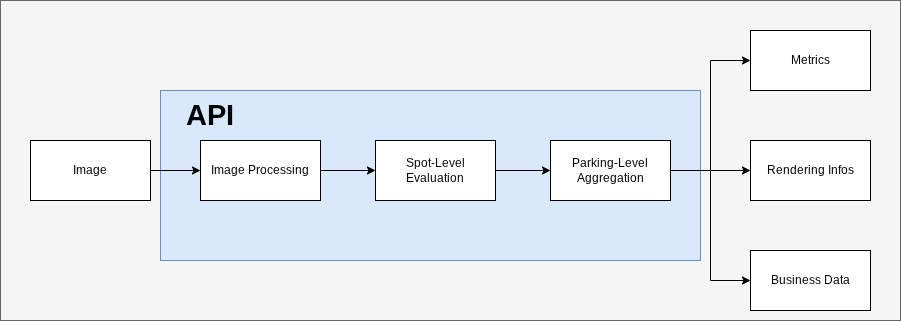

# Smart Parking — Multi-Camera Vision System

### Real-time, CPU-efficient, stateful parking occupancy detection

---

<p align="center">
  
</p>

---

## Overview

**Smart Parking** is a production-oriented computer vision system designed to estimate parking occupancy in **constrained environments** using **CPU-only inference**.

Unlike typical deep-learning-heavy approaches, this system focuses on:

* deterministic behavior
* low resource consumption
* robustness to real-world conditions

It is built as a **multi-camera, stateful API** capable of handling concurrent video streams while maintaining **persistent system state** and **fault isolation**.

---

## Key Features

* **Multi-camera support** (concurrent processing)
* **Real-time inference on CPU-only hardware**
* **Stateful architecture** with persistent recovery
* **Automatic reload after restart**
* **Per-camera isolation (fault tolerant)**
* **Live metrics (FPS, latency, occupancy)**
* **Fully Dockerized deployment**
* **Stress-tested & production-ready API**

---

## Architecture

The system is structured as a modular, layered pipeline:

```
API Layer
   ↓
Camera Manager (multi-cam orchestration)
   ↓
C++ Binding (performance-critical layer)
   ↓
Vision Engine (image processing & inference)
   ↓
Spot-Level State Tracking
   ↓
Parking-Level Aggregation
```

### Design Principles

* **Separation of concerns** (API / Engine / Native layer)
* **Deterministic state management**
* **Failure isolation per camera**
* **Edge deployment compatibility**

---

## System Pipeline

<p align="center">
  
</p>

The processing pipeline is divided into three main stages:

### 1. Image Processing

Extracts relevant visual features from raw frames under constrained conditions.

### 2. Spot-Level Evaluation

Each parking spot maintains its own evolving state, ensuring:

* temporal consistency
* robustness to lighting changes
* stability under minor camera motion

### 3. Parking Aggregation

Aggregates all spot states into a global parking occupancy model and exposes:

* occupancy metrics
* visualization data
* API outputs

---

## API Capabilities

The API is organized into three main domains:

* **Parking Processing** (`/parking`)
* **Metrics & Monitoring** (`/metrics`)
* **System Management** (`/system`)

---

### Parking Endpoints

* `GET /parking/{camera_id}/snapshot` → Retrieve latest processed frame
* `GET /parking/{camera_id}/stats` → Get parking occupancy statistics
* `POST /parking/{camera_id}/frame` → Send frame for processing

---

### Metrics Endpoints

* `GET /metrics/{camera_id}` → Per-camera metrics (FPS, latency, occupancy)
* `GET /metrics/` → Global system metrics

---

### System Endpoints

* `GET /system/cameras` → List all cameras

* `POST /system/cameras` → Add a new camera

* `DELETE /system/cameras/{camera_id}` → Remove a camera

* `POST /system/cameras/{camera_id}/restart` → Restart a camera worker

* `GET /system/cameras/{camera_id}/health` → Camera health status

* `GET /system/cameras/{camera_id}/state` → Internal camera state

---

### Design Rationale

The API separates concerns into three layers:

* **Parking** → business-level vision processing
* **Metrics** → observability and performance monitoring
* **System** → lifecycle and orchestration of cameras

This structure ensures clarity between **vision logic**, **system control**, and **monitoring**, while remaining easy to extend.

### Metrics Exposed

* FPS per camera
* Processing latency
* Occupied spots
* Total spots

---

## State Persistence

The system maintains a **fully persistent state**, including:

* Camera configurations (JSON)
* Reference images
* Spot definitions

### Guarantees

* Full system recovery after restart
* No data loss with Docker volumes
* Deterministic state reconstruction

---

## Deployment

### API

```bash
docker build -f Dockerfile.api -t smart-parking-api .
docker run -p 8000:8000 -v $(pwd)/data:/app/data smart-parking-api
```

### Embedded Runtime

```bash
docker build -f Dockerfile.embedded -t smart-parking-embedded .
docker run --rm smart-parking-embedded
```

---

## Robustness & Testing

The system has been validated through:

* Multi-camera stress tests
* Invalid input handling (images / JSON)
* Crash recovery scenarios
* High-frequency frame ingestion
* Camera failure isolation

A failing camera **never impacts other streams**.

---

## Performance

**Resolution**: 1080p
**FPS**: 12–14 (CPU-only)

**Hardware**:

* ARM aarch64
* Cortex-A55 / Cortex-A78
* 6GB RAM

The system is optimized for **edge devices** and low-power environments.

---

## Limitations

### Operational Assumptions

* Semi-fixed top-down camera
* Limited perspective distortion
* Moderate lighting variations

### Known Limitations

* Severe occlusions
* Extreme lighting changes
* Dynamic camera movement
* Manual parking configuration required

### Trade-offs

* CPU-only limits per-device scalability
* Stability prioritized over peak accuracy

---

## Use Cases

* Smart parking systems
* Industrial site monitoring
* Low-cost edge deployments
* Embedded vision systems

---

## Roadmap

### Next Iterations

* Automatic camera calibration
* Improved temporal tracking
* Enhanced multi-camera scaling
* Cloud monitoring integration

---

## Repository Structure

```
api/                → FastAPI application (routes & HTTP layer)
core/               → Business logic & state management
bindings/           → C++ bindings (performance-critical components)
embedded/           → Embedded runtime configuration

docs/               → Documentation assets (images, diagrams)
scripts/            → Utility scripts

Dockerfile.api      → API container
Dockerfile.embedded → Embedded runtime container
CMakeLists.txt      → Native build configuration
```

---

### Architectural Breakdown

* **api/**
  Handles all HTTP interactions and exposes the public interface.

* **core/**
  Contains the main domain logic:

  * parking state management
  * camera orchestration
  * aggregation logic

* **bindings/**
  Bridges Python and C++ for performance-critical operations.

* **embedded/**
  Dedicated environment for constrained or edge deployments.

---

This separation enforces a clean architecture between:

* interface (API)
* domain logic (core)
* performance layer (C++)

---

## Conclusion

This project demonstrates how a **carefully engineered vision pipeline** can outperform heavier approaches in constrained environments.

It highlights strong capabilities in:

* real-time computer vision
* backend system design
* multi-camera orchestration
* production-grade robustness

---

**Positioning**:
Real-time Vision Engineer
Backend Engineer for AI Systems
Edge AI / Embedded Vision Developer